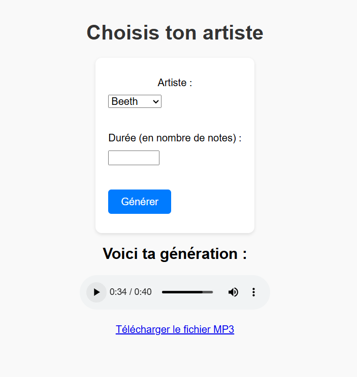

# Music_generation_LSTM

<hr>
Contraintes actuelles des données en entrée (sinon le modèle a moins de chances de faire une sortie cohérente):  

- Un seul instrument de musique par dataset (ne gère pas les orchestres etc.)
- Dataset avec un style homogène


Pour faire tourner Pytorch sur le GPU : pip3 install torch torchvision torchaudio --index-url https://download.pytorch.org/whl/cu118


Pour faire tourner le modèle : Fichier LSTM_Pytorch.py

Indiquer le chemin d'accès vers les fichiers MIDI dans la variable PATH. Attention, il faut que les fichiers soient au format .mid et qu'il n'y ait pas de sous-dossiers.

Si vous avez des sous-dossiers, il faut renseigner le chemin dans SOURCE qui va ensuite les copier dans PATH

Il y aura ensuite un entrainement du modèle pour chaque compositeur dans COMPOSER. Si vous voulez un modèle qui peut générer de la musique de tous les compositeurs, mettre "all" dans COMPOSER.

## UI

The UI is built with Flask to create an easy-to-use web application with a python backend. 


## Demo

Mp4 video of the app in action: 

https://github.com/user-attachments/assets/c5d615d5-7a28-4e68-b76e-74008f6e5d1d

## Requirements

### Download the dataset

- [Classical Music MIDI](https://www.kaggle.com/datasets/soumikrakshit/classical-music-midi) - 1.5 GB of classical music MIDI files from various composers. The dataset contains MIDI files of classical music pieces, which can be used for training the LSTM model.

- Extract all the musicians' folders in a the folder **app/static/raw_datasets**.

### Download the soundfont


- [FluidR3 GM SoundFont](https://member.keymusician.com/Member/FluidR3_GM/index.html) - A GeneralUser GS SoundFont. This is a free soundfont that can be used to play MIDI files. It contains a wide range of instrument sounds and is compatible with most MIDI players.

- Download the **FluidR3_GM.sf2** file and place it in the **app/static/sound_fonts** folder.

### Setup the environment from mid to mp3

- Download **FluidSynth** : https://github.com/FluidSynth/fluidsynth/releases
- Add the path to the **FluidSynth** executable to your system's PATH environment variable. This will allow you to run FluidSynth commands from the command line. Example: `C:\Users\username\Documents\GitHub\Music_generation_LSTM\app\static\FluidSynth\fluidsynth-2.4.4-win10-x64\bin;`
- Download **SDL3.dll**
- Put the **SDL3.dll** file in the same directory as the **FluidSynth** executable so the **bin** folder of **FluidSynth**.
- Download **ffmpeg** : https://www.ffmpeg.org/
- Add the path to the **ffmpeg** executable to your system's PATH environment variable. This will allow you to run ffmpeg commands from the command line. Example: `C:\ffmpeg`

## Setup app

- Create a virtual environment:
```bash
python -m venv .venv
```

- Activate the virtual environment:
```bash
.venv\Scripts\activate
```
or
```bash
source .venv/bin/activate
```
- Install dependencies:
```bash
pip install -r requirements.txt
```
- Install GPU version of Pytorch (if you have a GPU):
```bash
pip install torch torchvision torchaudio --index-url https://download.pytorch.org/whl/cu118
```

- Modify in **LSTM_Pytorch.py** file to fit your needs:
```python
absolute_fluidsynth_path = r"C:\Users\username\Documents\GitHub\Music_generation_LSTM\app\static\FluidSynth\fluidsynth-2.4.4-win10-x64\bin"  # To CHANGE
absolute_ffmpeg_path = r"C:\ffmpeg" # To CHANGE
```

- Go to the app directory:
```bash
cd app
```
- Run the app:
```bash
python app.py
```
